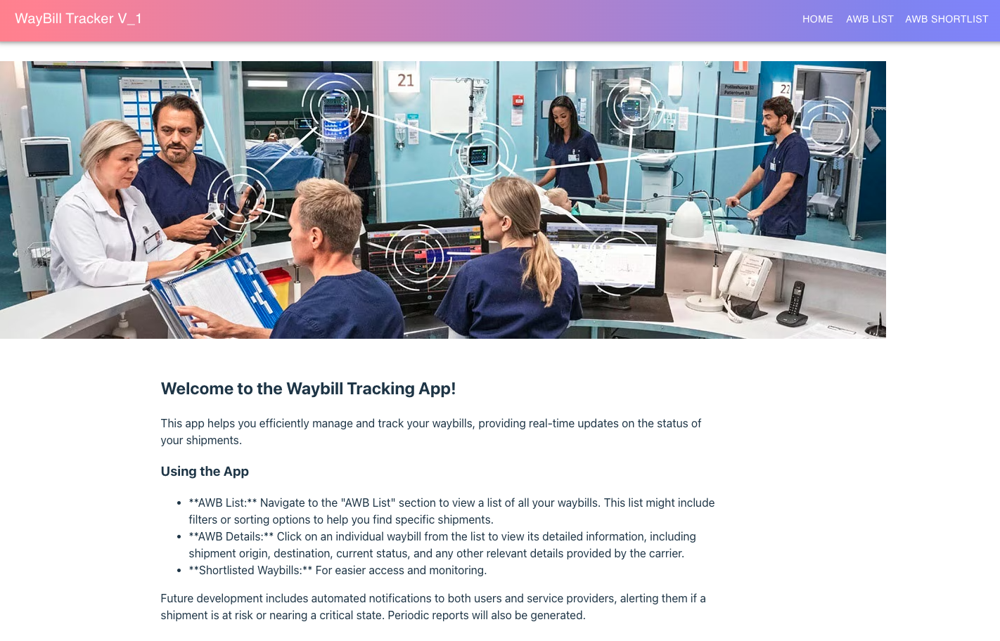
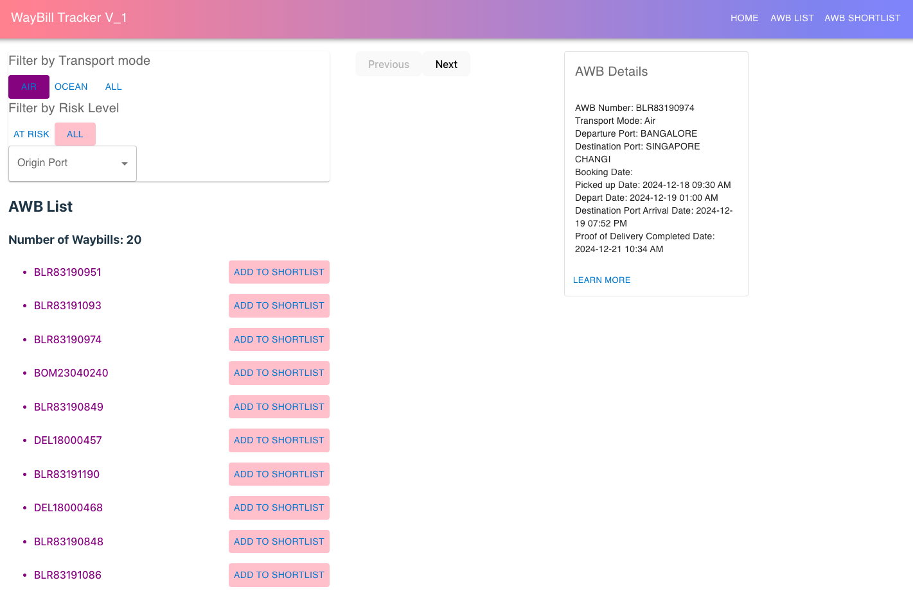
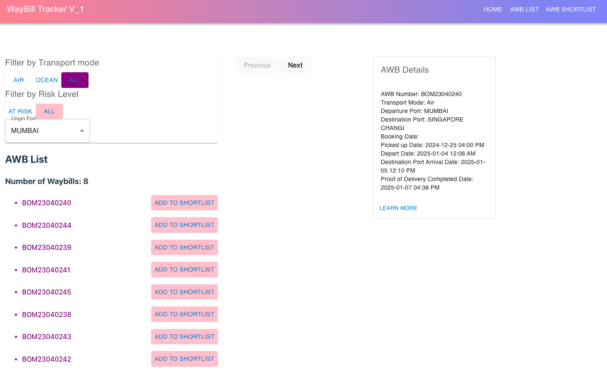
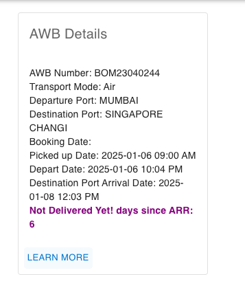
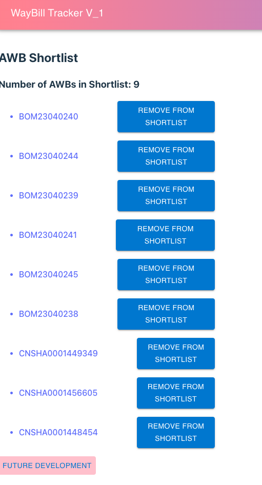

# Title: AWB-Tracker

# Description

This application streamlines supply chain management for engineers (users) by automating the monitoring of critical Air Waybills (AWBs). While designed to integrate with Oracle Trade Management (OTM), it currently fetches AWB data manually uploaded from OTM into Airtable via API. Key features include identifying potential shipment risks, allowing users to proactively monitor specific lanes or shipments, and creating a shortlist of critical AWBs. By automating these tasks, the application users to minimize manual effort and focus on strategic initiatives. Future enhancements will include generating reports and sending notifications to proactively address potential shipment issues.

# User Stories

1. As a user, I want to filter for AWBs based on mode type (done) and country origin (done).
2. As a user, I want to view a list of AWBs so that I can see all available shipments and/or i can filter based on the mode and lane. (done)
3. As a user, I want to see detailed information about a specific AWB so that I can track its status. (done)
4. As a user, I want to see an indication if a shipment is delayed so that I can be aware of potential issues.  
5. As a user, i want an email to be sent cc myself and service provider to request update of at risk shipments (future backend)
6. As a user, i want a weekly table report on the status of the near risk or at risk shipments (future backend)

# Link

https://awb-tracker.vercel.app/

# Challenges

adding the filter logic, trial and error + testing involved 
Airtables had a default ceiling cap of 100 API items, had to spend time reading its documentation for a bypass to lift the cap

# Stretched Goals

Adding Pagination to AWBList for ease of scrolling 

# references
https://dev.to/canhamzacode/how-to-implement-pagination-with-reactjs-2b04
https://www.educative.io/answers/how-to-implement-pagination-in-reactjs
https://www.youtube.com/watch?v=6fOuDxcbjyg
https://developer.mozilla.org/en-US/docs/Web/JavaScript/Reference/Global_Objects/Date/toLocaleDateString
https://mui.com/
chatgpt

# Project Snapshots

** Homepage with instructions

** AWBList with at risk and mode filtering option

** AWBList page with filtering option for origin option

** AWB Details with the calculated number of days since last timestamp

** AWB Shortlist page with future development button at footer
